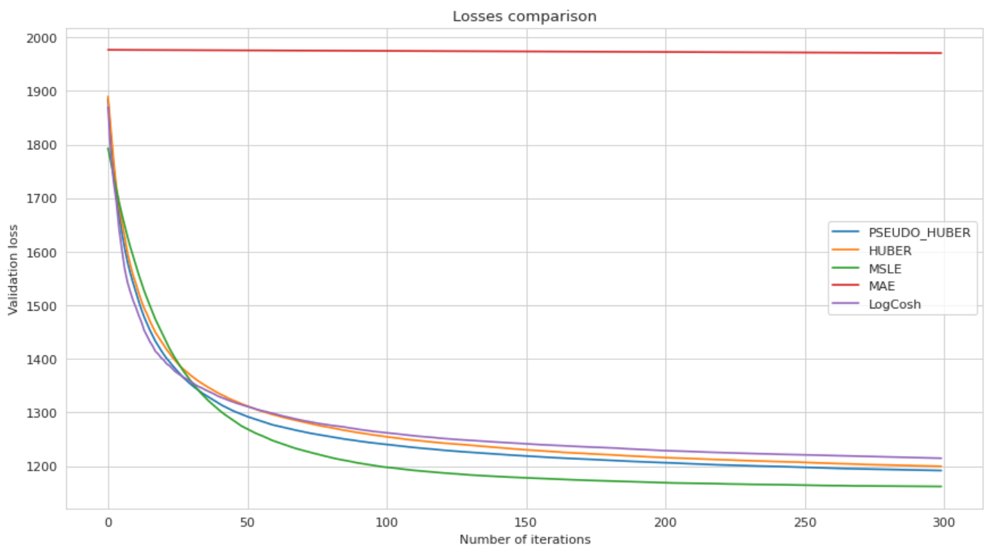
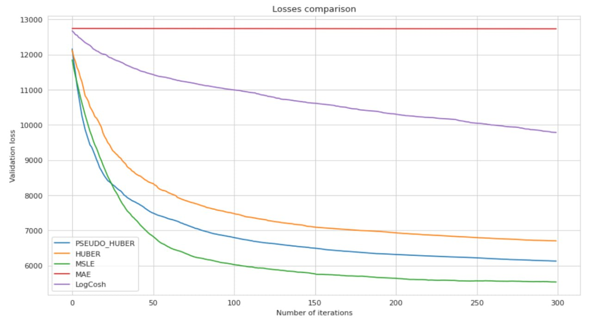
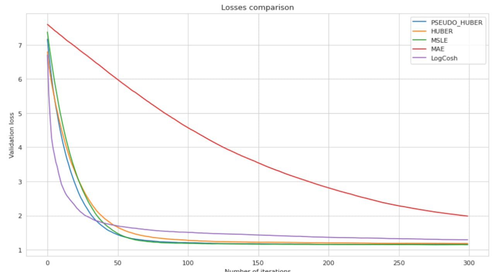

## TODO: обновить requirements.py, написать, как запускать код, вставть заключение и промежуточные пару предложений с репорта; поменять в юпитерноутбуке названия датасетов на те, что в папке /data, указать норм путь к ней, добавть в папку allstate (файлы >25 мб напрямую не грузятся).

# Py-Boost custom losses

The repository for final project at [ML course](https://github.com/adasegroup/ML2023_lectures) at Skoltech - "Several custom losses implementation for the median regression task in Py-Boost".

КРАТКАЯ СВОДКА

## Usage
НАПИСАТЬ, КАК ЗАПУСАТЬ КОД

## Datasets:
- [Allstate Claims Severity](https://www.kaggle.com/competitions/allstate-claims-severity/data)
- [House Prices - Advanced Regression Techniques](https://www.kaggle.com/competitions/house-prices-advanced-regression-techniques/data)
- [Life Expectancy](https://www.kaggle.com/datasets/kumarajarshi/life-expectancy-who)
- [Car Price Prediction Challenge](https://www.kaggle.com/datasets/deepcontractor/car-price-prediction-challenge?select=car_price_prediction.csv)

## Results
ЧЕ ТО ТАМ ЧЕ ТО ТАМ

### Allstate

<table>
<thead>
  <tr>
    <th>Loss</th>
    <th>Pseudo Huber</th>
    <th>Huber</th>
    <th>MSLE</th>
    <th>MAE</th>
    <th>LogCosh</th>
  </tr>
</thead>
<tbody>
  <tr>
    <td><b>Value</b></td>
    <td>1139</td>
    <td>1139</td>
    <td><b>1140</b></td>
    <td>1915</td>
    <td>1152</td>
  </tr>
</tbody>
</table>

### House Prices

<table>
<thead>
  <tr>
    <th>Loss</th>
    <th>Pseudo Huber</th>
    <th>Huber</th>
    <th>MSLE</th>
    <th>MAE</th>
    <th>LogCosh</th>
  </tr>
</thead>
<tbody>
  <tr>
    <td><b>Value</b></td>
    <td>5476</td>
    <td>5889</td>
    <td><b>5800</b></td>
    <td>12687</td>
    <td>7356</td>
  </tr>
</tbody>
</table>

### Life Expectancy

<table>
<thead>
  <tr>
    <th>Loss</th>
    <th>Pseudo Huber</th>
    <th>Huber</th>
    <th>MSLE</th>
    <th>MAE</th>
    <th>LogCosh</th>
  </tr>
</thead>
<tbody>
  <tr>
    <td><b>Value</b></td>
    <td>1.17</td>
    <td>1.16</td>
    <td><b>1.13</b></td>
    <td>1.20</td>
    <td>1.34</td>
  </tr>
</tbody>
</table>

### Car Price Prediction Challenge

<table>
<thead>
  <tr>
    <th>Loss</th>
    <th>Pseudo Huber</th>
    <th>Huber</th>
    <th>MSLE</th>
    <th>MAE</th>
    <th>LogCosh</th>
  </tr>
</thead>
<tbody>
  <tr>
    <td><b>Value</b></td>
    <td>5872</td>
    <td>5941</td>
    <td><b>5868</b></td>
    <td>12691</td>
    <td>6892</td>
  </tr>
</tbody>
</table>

## Team 13:
- Danil Ivanov
- Stas Pyatkin
- Bari Khairullin
- Dmitriy Kornilov
- Danil Gusak
